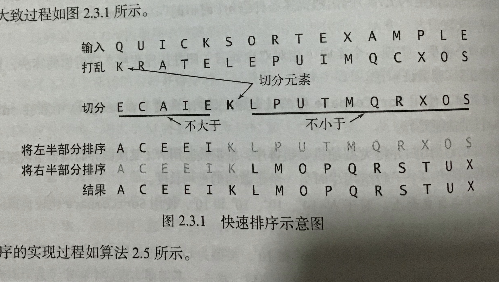

# 排序

``` javascript
class Sort {
  static less(v, w) {
    return v < w;
  }
  static exch(array, i, j) {
    [array[i], array[j]] = [array[j], array[i]];
  }
  static isSorted(array) {
    for (let i = 1, len = array.length; i < len; i++) {
      if (this.less(array[i], array[i - 1])) {
        return false;
      }
    }
    return true;
  }
  static sort(array) {
    return array.sort((a, b) => a - b);
  }
}
```


## 冒泡排序


### 思路介绍

从左到右比较相邻的两个元素，小的放在前面。一次循环完毕，最大值沉积到最后。

如此往复，排序完成时最小值冒到顶端。

``` javascript
class Bubble extends Sort {
  static sort(array) {
    const N = array.length;
    for (let i = 0; i < N - 1; i++) {
      for (let j = 0; j < N - 1 - i; j++) {
        if (this.less(array[j + 1], array[j])) {
          this.exch(array, j, j + 1);
        }
      }
    }
    return array;
  }
}
```

### 效率分析

比较次数： ~$N^2/2$

交换次数： ~$N^2/2$

最坏情况：逆序，~$N^2/2$次比较，~$N^2/2$次交换

最好情况：正序，~$N^2/2$次比较，0次交换

## 选择排序


### 思路介绍

选择数组中最小的元素，和数组的第一个元素交换。

在剩下的元素中选择最小的元素，和数组的第二个元素交换。

如此往复，直到整个数组排序。

``` javascript
class Selection extends Sort {
  static sort(array) {
    const N = array.length;
    for (let i = 0; i < N; i++) {
      let min = i;
      for (let j = i + 1; j < N; j++) {
        if (this.less(array[j], array[min])) {
          min = j;
        }
      }
      this.exch(array, i, min);
    }
    return array;
  }
}
```

### 效率分析

比较次数：~$N^2/2$

交换次数：$N$

最坏/最好情况：所有输入都需要~$N^2/2$次排序，交换次数在0~N之间，没有太大区别

### 附加说明

选择排序的效率和数组的初始状态无关，不管是有序数组还是全相等数组都需要进行N^2级的比较，选择排序的效率更加依赖于数组规模。

选择排序的交换次数和数组大小是线性关系。选择排序最多交换N次，在大多数情况下选择排序比冒泡排序效率好一些。

## 插入排序

### 思路介绍

和整理扑克牌是同一思路。

在实现时，当前索引左边是有序序列，右边是无序序列。

取无序序列的第一个元素，找到该元素在有序序列中的位置插入。

如此往复。

``` javascript
function insertionSort(array) {
  const N = array.length;
  for (let i = 0; i < N; i++) {
    for (let j = i; j > 0 && less(array[j], array[j - 1]); j--) {
      exch(array, j, j - 1);
    }
  }
}
```

### 效率分析

最坏情况：逆序，~$N^2/2$次比较，~$N^2/2$次交换

最好情况：正序，$N-1$次比较，0次交换

比较次数：平均情况~$N^2/4$

交换次数：平均情况~$N^2/4$

平均情况下每个元素都有可能向后移动半个数组的长度，是最坏和最好之间的折中估值


优化方案：取出无序元素，比较，向右移动较大元素


``` javascript
function insertionSort(array) {
  const N = array.length;
  for (let i = 1; i < N; i++) {
    const elem = array[i];
    let j = i;
    for (; j > 0 && less(elem, array[j - 1]); j--) {
      array[j] = array[j - 1];
    }
    array[j] = elem;
  }
}
```

### 附加说明

插入排序对于部分有序的数组十分高效，也适合小规模数组。


## 希尔排序

### 思路介绍

在插入排序的基础上进行改进：

- 插入排序对于部分有序的数组十分高效，也适合小规模数组
- 插入排序只会交换相邻的元素，元素只能从数组一端一点一点挪动到另一端，在处理**大规模乱序数组**时非常低效

希尔排序基于插排的上述特征进行改进

- 将**大规模乱序数组**简化为**小规模随机数组**分块排序
- **交换不相邻**的元素达到部分有序状态，再进行整体插排达成有序。

#### 增量

数组元素的位置间隔 称为 **“增量”**

如果以固定增量对数组进行分组，增量越大

- 元素的覆盖跨度越大
- 每组包含的元素数量越小

小规模的随机数组非常适合进行插排

如果我们设定增量N=length/2，那么将分到N组，每组包含2个元素

#### 增量序列

大增量小规模排序之后，缩小增量再排序，如此往复。最终增量值缩小为1时，数组整体已经是大范围有序的状态，只需进行微调，这时做整体插排效率极高。

上述过程中使用的增量组成{length/2,(length/2)/2...1}这样的序列称为**增量序列**

希尔排序也称为**递减增量排序**


``` javascript
class Shell extends Sort {
  static sort(array) {
    const N = array.length;
    let h = 1;
    while (h < Math.floor(N / 3)) {
      h = 3 * h + 1; // 动态计算gap
    }
    while (h >= 1) {
      for (let i = h; i < N; i++) {
        let elem = array[i];
        let j = i;
        for (; j > 0 && this.less(elem, array[j - h]); j -= h) {
          array[j] = array[j - h];
        }
        array[j] = elem;
      }
      h = Math.floor(h / 3);
    }
    return array;
  }
}

```

### 附加说明

在处理中等规模（代码测试大约是1000以下）的随机数组时，高级排序和希尔排序的性能差距并不明显。规模越大，高级排序的效率优势便显而易见了。


## 归并排序

### 思路介绍

是分治思想的典型应用。分：大问题拆分为小问题，治：归并问题答案


归并排序可以使用自上而下的递归，或者自下而上的迭代实现。（递归和迭代是可互相转换的行为）

#### 自上而下递归

递归函数：拆分出左序列和右序列 + 使用双指针有序归并左右序列

``` javascript
class RecursionMerge extends Sort {
  static sort(array) {
    const length = array.length;
    if (length < 2) {
      return array;
    }

    const middle = Math.floor(length / 2);
    const left = array.slice(0, middle);
    const right = array.slice(middle);
    return this.merge(this.sort(left), this.sort(right));
  }
  static merge(left, right) {
    const result = [];
    let lIndex = 0;
    let rIndex = 0;
    const leftLength = left.length;
    const rightLength = right.length;
    while (lIndex < leftLength && rIndex < rightLength) {
      if (this.less(left[lIndex], right[rIndex])) {
        result.push(left[lIndex++]);
      } else {
        result.push(right[rIndex++]);
      }
    }

    for (; lIndex < leftLength; lIndex++) {
      result.push(left[lIndex]);
    }

    for (; rIndex < rightLength; rIndex++) {
      result.push(right[rIndex]);
    }

    return result;
  }
}
```

*P.S.遇到一个注意点：之前的代码使用shift代替索引自增，数组shift需要将所有元素都向前移一位，会带来额外的性能消耗。*

由于`javascript`词法环境栈的运行机制，递归的最大深度受到限制，同时对栈的管理也会消耗额外资源。所以我们来研究一下迭代的实现方法。

自下而上，也就是从两两归并开始，进行归并的左右数组逐步增大，最终数组长度达到原始长度时排序完毕。

``` javascript
class IterationMerge extends Sort {
  static sort(array) {
    const N = array.length;
    for (let size = 1; size < N; size += size) {
      // size 子数组大小
      // 从左到右进行分组归并排序，每组包括左右子数组，即两个size长的数组
      for (let start = 0; start < N - size; start += size + size) {
        // start 分组的起始索引, end 分组的结束索引
        const middle = start + size - 1;
        const end = Math.min(N - 1, start + size + size - 1);
        this.merge(array, start, middle, end);
      }
    }
    return array;
  }

  static merge(array, start, middle, end) {
    const compareArray = array.slice(start, end + 1);
    let index = start;
    let lIndex = start;
    let rIndex = middle + 1;

    while (index <= end) {
      if (lIndex === middle + 1) {
        array[index++] = compareArray[rIndex++];
      } else if (rIndex === end + 1) {
        array[index++] = compareArray[lIndex++];
      } else {
        if (compareArray[lIndex] < compareArray[rIndex]) {
          array[index++] = compareArray[lIndex++];
        } else {
          array[index++] = compareArray[rIndex++];
        }
      }
    }
  }
}
```

执行代码比较后发现，迭代的效率低于递归的效率

### 效率分析

平均复杂度：$O(NlogN)$


归并排序的过程可以想象为一颗树

假设这颗树有$n$层，第$k$层有$2^k$个子数组，每个子数组有$2^{n-k}$个元素，每层的比较次数为$2^k * 2^{n-k}=2^n$。$n$层总共为$n2^n$次

在归并排序的操作树中，$N$个元素能构成$lgN$层树，因此复杂度为$lgN * 2^{lgN} = NlgN$


## 快速排序

快速排序也是分治思想的一个典型应用。



简单描述一下最小步骤：

- 随意找一个基准元素，把小于等于元素的值放到元素左边，大于元素的值放右边。这一操作称为“切分”。
- 左右数组各自排序之后，整体也就自然有序了。

### 切分

- 取第一个元素作为切分元素
- 从数组的左端向右扫描找到一个大于它的元素A
- 从数组的右端向左扫描找到一个小于它的元素B
- 交换A和B的位置
- 当两个指针相遇时，交换切分元素和左数组最末元素替换位置

